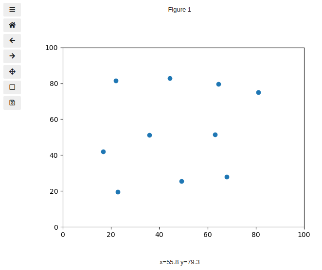
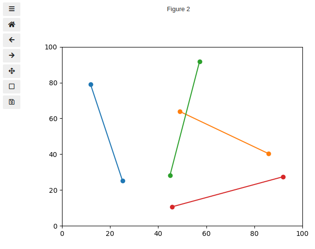
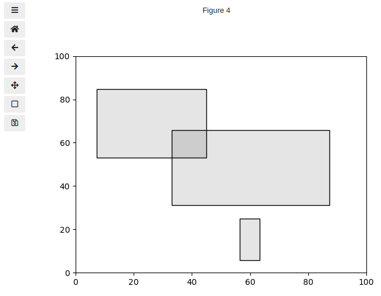
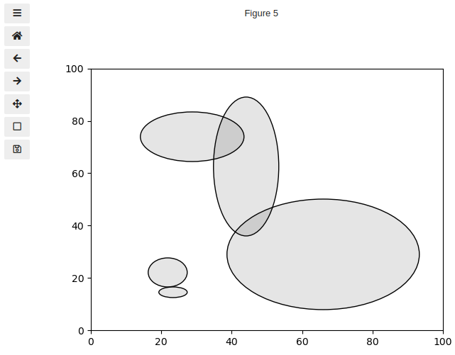

# mpltoolbox

Mpltoolbox aims to provide some basic tools (that other libraries such as bokeh or plotly support) for drawing points, lines, rectangles, polygons on Matplotlib figures.

There are many interactive examples in the Matplotlib documentation pages,
but the code snippets are often long and potentially not straightforward to maintain.

With `mpltoolbox`, activating these tools should (hopefully) just be a on-liner.

## Documentation

The documentation for `mpltoolbox` can be found at https://mpltoolbox.readthedocs.io.

## Installation

```sh
pip install mpltoolbox
```

## Examples

```Py
import matplotlib.pyplot as plt
import mpltoolbox as tbx
%matplotlib widget
```

### Points

```Py
fig, ax = plt.subplots()
ax.set_xlim(0, 100)
ax.set_ylim(0, 100)

points = tbx.Points(ax=ax)
```




### Lines

```Py
fig, ax = plt.subplots()
ax.set_xlim(0, 100)
ax.set_ylim(0, 100)

lines = tbx.Lines(ax=ax, n=2)
```



### Rectangles

```Py
fig, ax = plt.subplots()
ax.set_xlim(0, 100)
ax.set_ylim(0, 100)

rectangles = tbx.Rectangles(ax=ax)
```



### Ellipses

```Py
fig, ax = plt.subplots()
ax.set_xlim(0, 100)
ax.set_ylim(0, 100)

ellipses = tbx.Ellipses(ax=ax)
```


