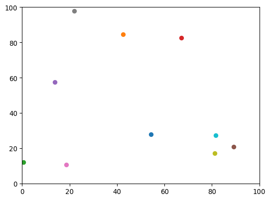
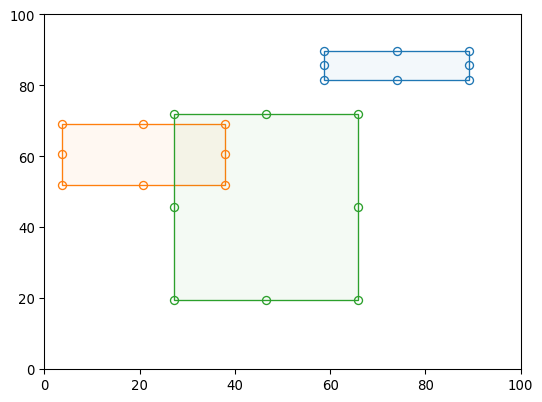
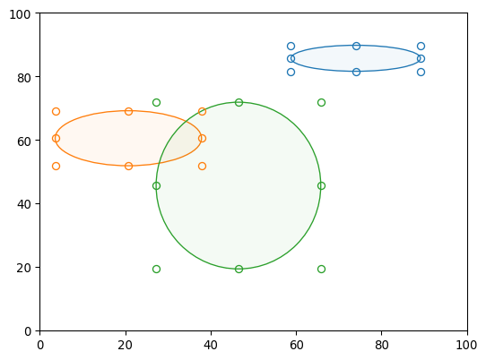
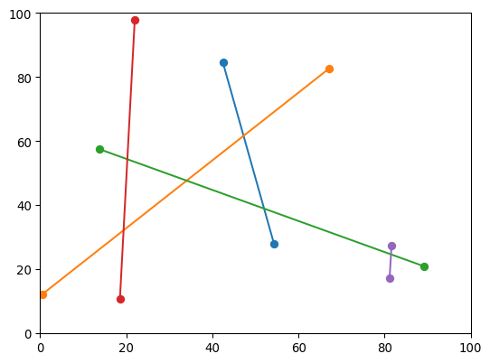

:::{image} _static/logo.svg
:class: only-light
:alt: Mpltoolbox
:width: 60%
:align: center
:::
:::{image} _static/logo-dark.svg
:class: only-dark
:alt: Mpltoolbox
:width: 60%
:align: center
:::

```{raw} html
   <style>
    .transparent {display: none; visibility: hidden;}
    .transparent + a.headerlink {display: none; visibility: hidden;}
   </style>
```

```{role} transparent
```

# {transparent}`Mpltoolbox`

<span style="font-size:1.2em;font-style:italic;color:var(--pst-color-text-muted)">
  Interactive tools for Matplotlib
  </br></br>
</span>

Mpltoolbox aims to provide some basic tools
(that other libraries such as
[bokeh](http://docs.bokeh.org/en/latest/) or
[plotly](https://plotly.com/python/) support)
for drawing points, lines, rectangles, polygons on Matplotlib figures.

There are many interactive examples in the Matplotlib
[documentation pages](https://matplotlib.org/stable/gallery/index.html#event-handling),
but the code snippets are often long and potentially not straightforward to maintain.

With ``mpltoolbox``, activating these tools should (hopefully) just be a on-liner.

## Installation

To install Mpltoolbox and all of its dependencies, use

`````{tab-set}
````{tab-item} pip
```sh
pip install mpltoolbox
```
````
````{tab-item} conda
```sh
conda install -c conda-forge mpltoolbox
```
````
`````

## Example

```python
import matplotlib.pyplot as plt
import mpltoolbox as tbx
%matplotlib widget

fig, axes = plt.subplots(2, 2, figsize=(12, 8))
for ax in axes.flat:
    ax.set_xlim(0, 100)
    ax.set_ylim(0, 100)

points = tbx.Points(ax=axes[0, 0])
lines = tbx.Lines(ax=axes[1, 1])
rects = tbx.Rectangles(ax=axes[0, 1])
ells = tbx.Ellipses(ax=axes[1, 0])
```

<table><tr>
<td></td>
<td></td>
</tr><tr>
<td></td>
<td></td>
</tr></table>

## Get in touch

- If you have questions that are not answered by these documentation pages, ask on [discussions](https://github.com/scipp/mpltoolbox/discussions). Please include a self-contained reproducible example if possible.
- Report bugs (including unclear, missing, or wrong documentation!), suggest features or view the source code [on GitHub](https://github.com/scipp/mpltoolbox).

```{toctree}
---
hidden:
---

points
lines
rectangles
ellipses
polygons
spans
advanced
api-reference/index
developer/index
about/index
```
